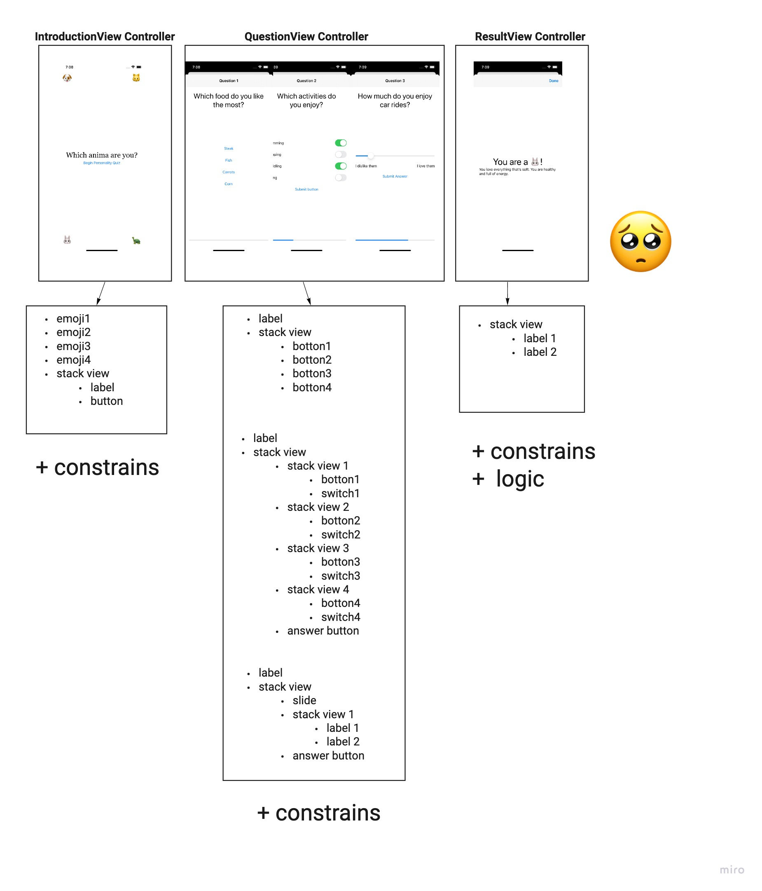

# WhichAnimalAreYou(no structure organizing)
- Swift project which let users to answer several  questions, and show them what kind animal they are

# File structure
- using no model, a lot of repetitive views are contained in same controllers

